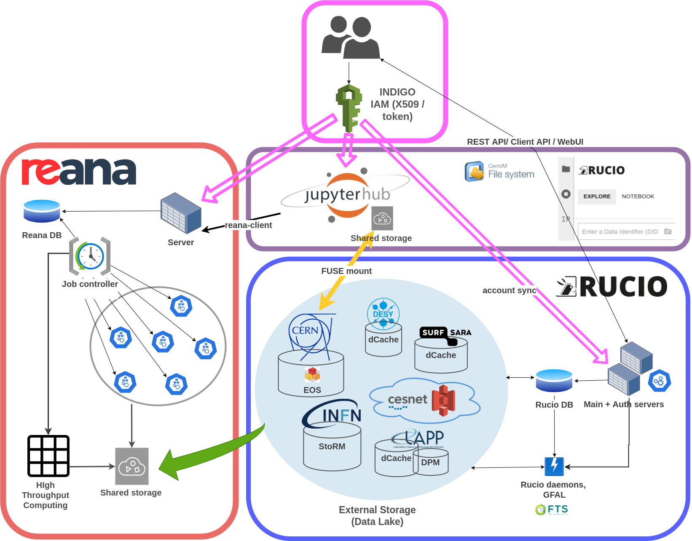

# The Virtual Research Environment

The Virtual Research Environment is an analysis platform developed at **CERN** serving the needs of scientific communities involved in European Projects. 
Its scope is to facilitate the development of **end-to-end physics workflows**, providing researchers with access to an **infrastructure** and to the digital content necessary to produce and preserve a scientific result in compliance with **FAIR** principles. 
The platform's development is aimed at demonstrating how sciences spanning from High Energy Physics to Astrophysics could benefit from the usage of common technologies, initially born to satisfy CERN’s **exabyte-scale data** management needs. 

The Virtual Research Environment’s main components are:

1. A federated and reliable **Authentication and Authorization** layer 
2. A **federated distributed storage** solution (the Data Lake), providing functionalities for data injection and replication through a Data Management framework (Rucio) 
3. A **computing** cluster supplying the processing power to run full analyses with Reana, a re-analysis software
4. An enhanced **notebook interface** with containerised environments to hide the infrastructure’s complexity from the user. 

The deployment of the Virtual Research Environment is open-source and modular, in order to make it easily reproducible by partner institutions; it is publicly accessible and kept up to date by taking advantage of state of the art IT-infrastructure technologies.

The Science Projects which are using the VRE are described [here](https://escape2020.pages.in2p3.fr/virtual-environment/home/). 

If you are a scientist or a new user curious to use the above resources, please refer to the following documentation:  
1. [AAI](docs/auth.md)
2. [Rucio Data Lake](docs/rucio.md)
3. [Reana cluster](docs/reana.md)
4. [Notebook service](docs/notebook.md)

If you want to deploy the VRE on your own infrastructure, of you want to submit an issue to help us improve the platform, please follow the [developer documentation](docs/developer.md). 
 
### Contact

- To contact the team at CERN working on the implementatin of the VRE, join the **[Slack channel](https://eosc-escape.slack.com/archives/C03Q65M1U5V)** or email us at *escape-cern-ops@cern.ch*. 
- To participate to the **VRE working-group monthly meetings**, join here: https://indico.cern.ch/category/17065/. These are intended for developers and system administrators who are supporting scientific infrastructures. It is an informal space to stimulate discussion and keep all the members up to date with the latest news and hot topics on the development and deployment of tools and services within the broad field of scientific analysis platforms.
- If you are a user of the VRE and you are experiencing technical issues, please join the **VRE users bi-weekly meetings on Tuesdays at 14 CET** at: https://indico.in2p3.fr/category/1033/
